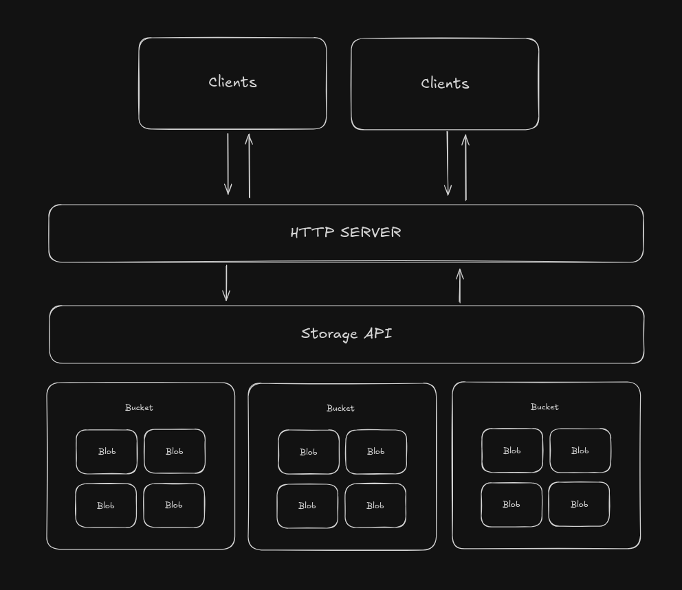

# Uncle Blob

Uncle Blob, is a self hosted object store. Its light, fast and super simple to set up and get going and **written in RUST** 

To start the server run the following command

    $ cargo run build

If you want to customize uncle blob you are free to fork it!

> The name 'Uncle Blob' is a combination of the famous clean code author Uncle Bob and the word 'Blob' which means Binary Large Object

## Inspiration

At times, as developers our projects usually start very small, that the is no need to sign up for an object store in on the cloud like S3 or Azure Blob Store which can cost money and can be a pain in arse. Sometimes you need to just get a quick self hosted solution as you are developing your app. When you are now ready for production you can switch to a cloud solution.

At the same time you might actually not want a cloud solution at all. A reason for this could be how costs for cloud services can go crazy and can be unpredictable. I have heard of folks who have woke up with their cloud bills at $130k. Therefore in order to save cost or just have almost constant costs you could just want a self hosted system maybe running on a VPS. This is where Uncle Blob comes in.

## How It Works
The smallest unit of data is called a blob. A blob represents any form of data in binary form like a picture could in .png or .jpg format. This data is in its binary form!

Blobs are then grouped to form buckets. Buckets help better oragnise the grouping blobs.

> Note that the file server doesn't create seperate directories for each bucket



From the given diagram, we can observe that blobs are grouped into buckets. There can be multiple buckets.

A Storage API abstracts away the physical storage of the blobs on the disk.

A REST HTTP server listens for requests from client applications like a website for example, that might be intending upload to retrieve blobs. The server fufills requests through the Storage API.

## REST API Structure

### Getting blobs (Retrieval)

> GET /storage/{bucket_name}/{file_name}

- the bucket_name is the name of the bucket
- the file_name is the name of the file (including its extension e.g. tadiwa.png)

An example request would be like so

> GET /storage/avatars/user-345.png

The server returns the blob in its binary, so if you where serving this on a web page, assuming uncle blob is listening on localhost:5050


```jsx

    export function UserAvatar() {
        return (
            
        );
    }

```

### Uploading a blob

> POST /storage/upload/{bucket_name}/{file_name}

> Body: The blob to be uploaded

- the bucket_name is the name of the bucket
- the file_name is the name of the file to be uploaded(including its extension e.g. tadiwa.png)
- the body should be the blob (in binary form) to be uploaded

An example fetch request


```tsx

    async function upload(file: File) {
        const url = "http://localhost:5050/storage/upload/avatars/user-178.png";

        await fetch(url, {
            body: file,
            method: "POST"
        });
    }

```

The server will return information about the newly uploaded blob object. For an exmple request

> http://localhost:5050/storage/upload/wallpapers/wally.jpg

The server will respond with 

``` json
    {
        "fileName": "wally.jpg",
        "bucketName": "wallpapers",
        "url": "http://127.0.0.1:5050/storage/wallpapers/wally.jpg"
    }
```

## Overwriting a blob

There are certain situations where you want to overwrite data that is already in an exisiting blob, for example if you were building a cloud word editor like google docs. The API usage is as follows

> PUT /storage/upload/{bucket_name}/{file_name}

In this case the url is the same it's just that this time the HTTP verb will be PUT not POST, to signify that data is being 
overwritten. 

The server will respond with (example data)

``` json
    {
        "fileName": "wally.jpg",
        "bucketName": "wallpapers",
        "url": "http://127.0.0.1:5050/storage/wallpapers/wally.jpg"
    }
```

## Deleting Blobs

Lastly we will look at deleting blobs. Uncle Blob under the hood makes use of a quite delete. Which means that if the blob doesn't exist it will simply ignore the request instead of throwing an error. I personally thought this would make error handling so much easier. you can always adjust this to your liking.

Just to be very sure, if the quiet delete was successful, a 200 response is sent back

> DELETE /storage/delete/{bucket_name}/{file_name}


# Importing Considerations

- Uncle Blob is not a mature project, so there could be issues or even areas where the project can be improved. Please feel free to open issues or even contribute.

- Uncle Blob is also relatively new therefore I would highly recommend that you throughly test it, beyond the testing that I did, to ensure that it works perefectly if you want to use it in production!

- Uncle Blob by default, has no authentication built in. You might want to fork it and customize it to add authentication and authorization.

> Authentication is definately something I would love to add eventually, maybe with a new CLI tool to do so! If you have any ideas feel free to reach in!